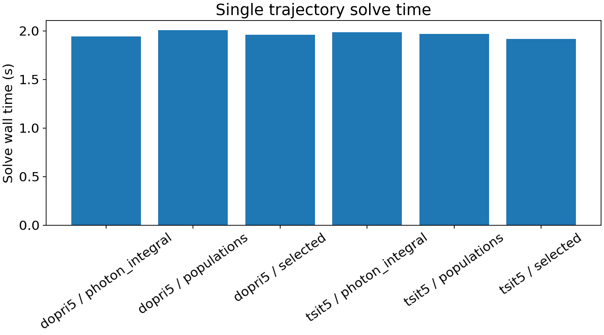
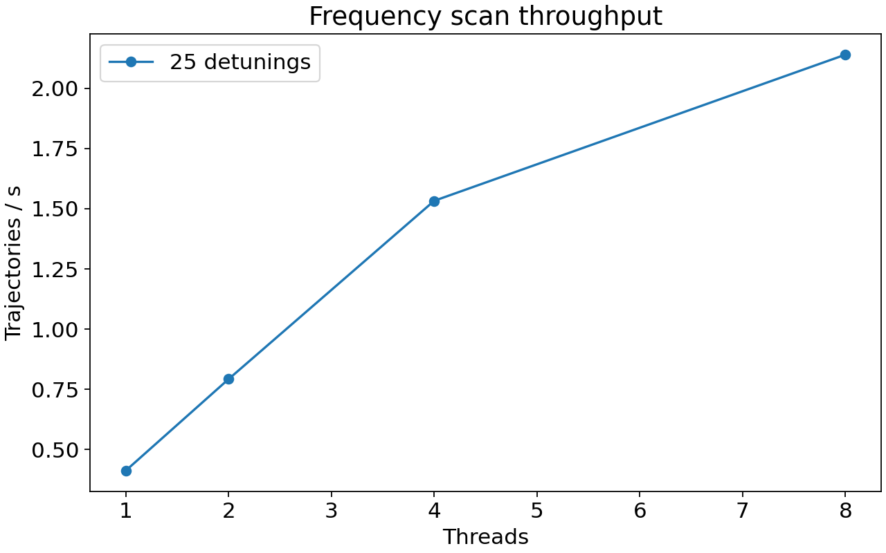
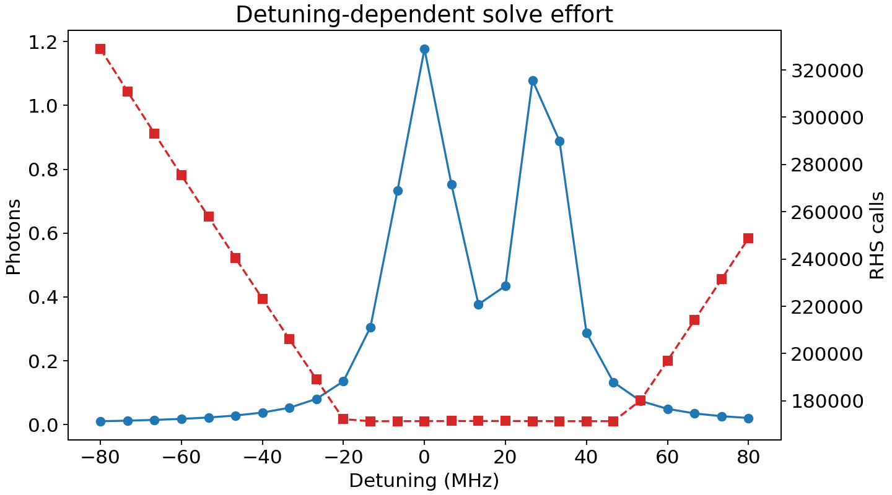
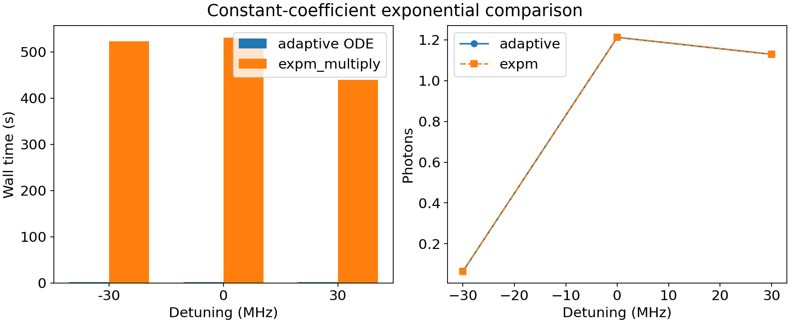
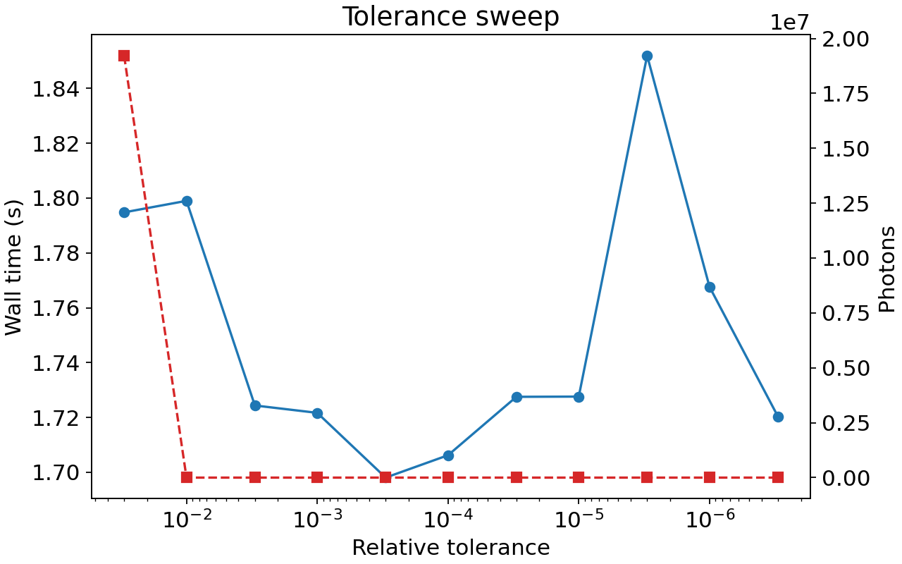

# OBE Solve-Time Speed Investigation

This report times only solve calls after the OBE system and Rust plan have been prepared.
Preparation timings are reported as context but excluded from solve-speed conclusions.

## Configuration

- Transition: `R(2) F1'=7/2 F'=3`
- Electric field: `[0.0, 0.0, 200.0]` V/cm
- Power: `60` mW over `2 cm x 2 cm`
- Interaction time: `108.696` us
- Intensity: `15.000` mW/cm^2

## Main Findings

- Fastest single-trajectory case in this run: `tsit5` / `selected` at `1.92` s.
- Best scan throughput in this run: `2.14` trajectories/s with `8` threads.
- Collapsing all decay-only ground states into one sink changed the photon-count solve time by a factor of `1.09` for the benchmark case.
- Sparse `expm_multiply` was `248x` slower than adaptive Rust ODE over the tested detunings.

## System Sizes

| model             | n_states | rho_entries | H_nnz | C_ops | C_nnz | rabi_MHz | prep_seconds_not_timed |
| ----------------- | -------- | ----------- | ----- | ----- | ----- | -------- | ---------------------- |
| per_J_sinks       | 38       | 1444        | 189   | 168   | 168   | 0.3062   | 10.56                  |
| single_decay_sink | 35       | 1225        | 186   | 126   | 126   | 0.3062   | 9.539                  |

## Single-Trajectory Solver Results

| solver | output          | output_when | save_points | wall_seconds | accepted_steps | rhs_calls | rhs_calls_per_second |
| ------ | --------------- | ----------- | ----------- | ------------ | -------------- | --------- | -------------------- |
| dopri5 | photon_integral | saveat      | 201         | 1.942        | 28568          | 1.714e+05 | 8.827e+04            |
| dopri5 | populations     | final       | 0           | 2.006        | 28568          | 1.714e+05 | 8.543e+04            |
| dopri5 | selected        | final       | 0           | 1.96         | 28568          | 1.714e+05 | 8.744e+04            |
| tsit5  | photon_integral | saveat      | 201         | 1.987        | 27654          | 1.659e+05 | 8.351e+04            |
| tsit5  | populations     | final       | 0           | 1.968        | 27654          | 1.659e+05 | 8.433e+04            |
| tsit5  | selected        | final       | 0           | 1.918        | 27654          | 1.659e+05 | 8.651e+04            |

## Frequency Scan Scaling

| scan_points | threads | wall_seconds | trajectories_per_second | speedup_vs_1_thread | parallel_efficiency | rhs_calls |
| ----------- | ------- | ------------ | ----------------------- | ------------------- | ------------------- | --------- |
| 25          | 1       | 60.68        | 0.412                   | 1                   | 1                   | 5.283e+06 |
| 25          | 2       | 31.56        | 0.7921                  | 1.923               | 0.9613              | 5.283e+06 |
| 25          | 4       | 16.31        | 1.533                   | 3.72                | 0.9301              | 5.283e+06 |
| 25          | 8       | 11.68        | 2.14                    | 5.194               | 0.6493              | 5.283e+06 |

## Detuning-Dependent Solver Effort

The adaptive solver does not spend exactly the same effort at each detuning.

## Constant-Coefficient Exponential Test

For constant E/B/light fields, the density matrix obeys a constant-coefficient linear ODE. The test below compares the adaptive Rust ODE result against a sparse augmented Liouvillian evaluated with `scipy.sparse.linalg.expm_multiply`.

| detuning_MHz | adaptive_wall_seconds | expm_wall_seconds | adaptive_photons | expm_photons | relative_photon_difference |
| ------------ | --------------------- | ----------------- | ---------------- | ------------ | -------------------------- |
| -30          | 2.132                 | 523.2             | 0.06481          | 0.06498      | 0.002662                   |
| 0            | 1.814                 | 530.3             | 1.213            | 1.213        | 0.0002929                  |
| 30           | 1.772                 | 439               | 1.129            | 1.13         | 0.000268                   |

## Tolerance Sweep

| rtol   | abstol | wall_seconds | photons   | accepted_steps | rhs_calls |
| ------ | ------ | ------------ | --------- | -------------- | --------- |
| 0.03   | 3e-05  | 1.795        | 1.922e+07 | 28580          | 1.715e+05 |
| 0.01   | 1e-05  | 1.799        | 1.142     | 28617          | 1.717e+05 |
| 0.003  | 3e-06  | 1.724        | 1.177     | 28619          | 1.717e+05 |
| 0.001  | 1e-06  | 1.722        | 1.177     | 28579          | 1.715e+05 |
| 0.0003 | 3e-07  | 1.698        | 1.177     | 28573          | 1.714e+05 |
| 0.0001 | 1e-07  | 1.706        | 1.177     | 28568          | 1.714e+05 |
| 3e-05  | 3e-08  | 1.728        | 1.177     | 28561          | 1.714e+05 |
| 1e-05  | 1e-08  | 1.728        | 1.177     | 28560          | 1.714e+05 |
| 3e-06  | 3e-09  | 1.852        | 1.177     | 28577          | 1.715e+05 |
| 1e-06  | 1e-09  | 1.768        | 1.177     | 28615          | 1.717e+05 |
| 3e-07  | 3e-10  | 1.72         | 1.177     | 28685          | 1.721e+05 |

Loosening tolerances does not reduce RHS calls for this benchmark. Very loose settings distort the photon count before providing a speed benefit, so tolerance relaxation is not a useful speed lever here.

## Notes

- The committed benchmark is intentionally bounded so it can be rerun interactively.
- Increase `scan_points` and `thread_counts` in the notebook for longer scaling runs such as 101/401 detunings and 12/16 threads.
- The current Rust photon-integral output integrates over saved output samples, so photon-count accuracy and runtime should be checked against `saveat` density.
