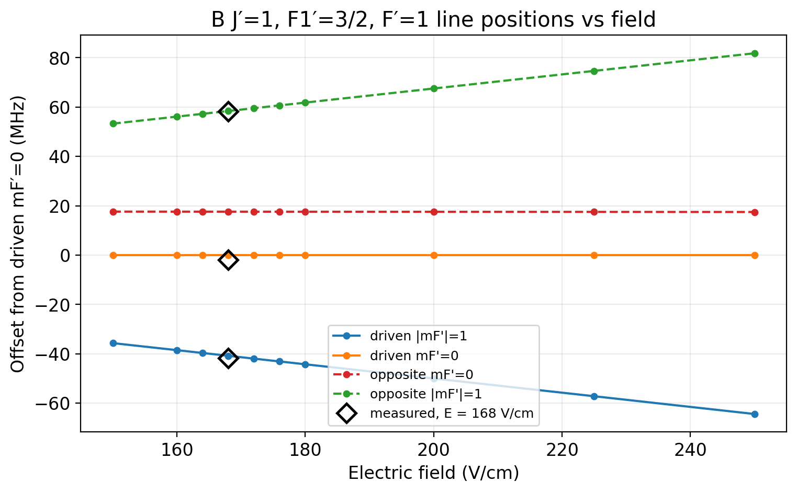
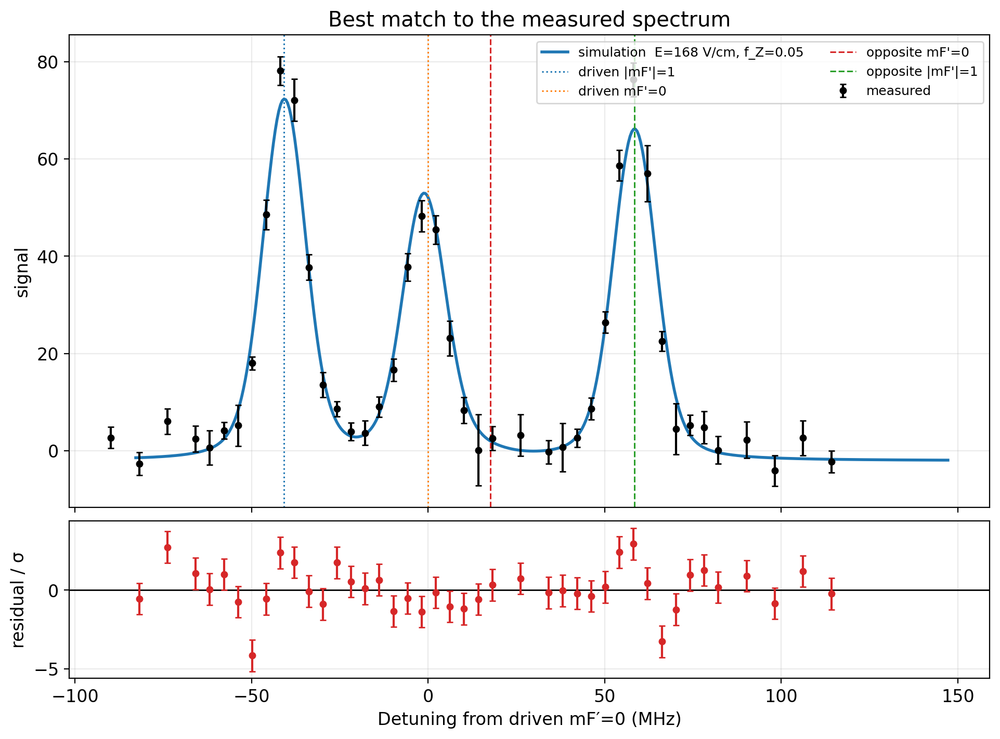
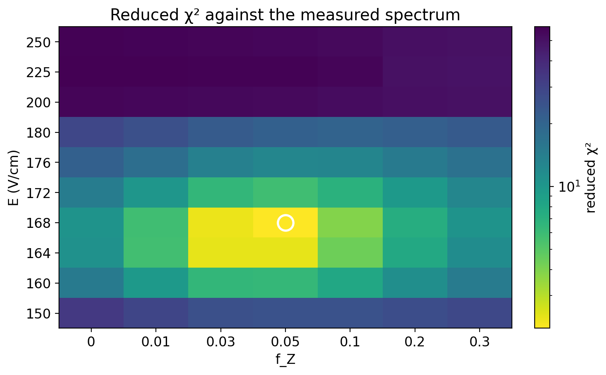
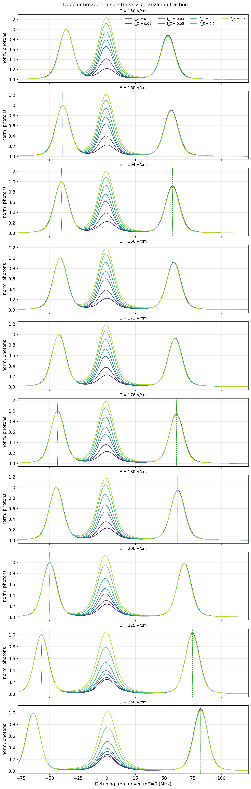
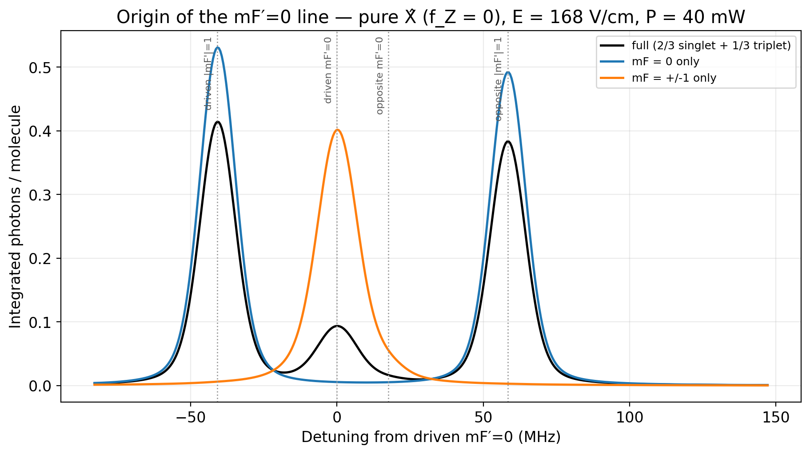

# P(2) F1′=3/2 F′=1 — simulated spectra and comparison with measurement

Companion writeup for `examples/lindblad/p2_f1_3o2_f1_mf_scan.ipynb`.

Optical-Bloch simulation of the CeNTREX **P(2) F1′=3/2 F′=1** transition, matched against a
measured frequency scan taken after rotational cooling, state preparation A and the electrostatic
lens. The unknowns going in were the DC electric field (somewhere in 150–250 V/cm), the X/Z
polarization admixture, and the optical power.

**Result: E = 168 V/cm, f_Z = 0.05, reduced χ² = 2.09.** The field is determined two independent
ways that agree exactly. The polarization is well constrained *given* the assumed initial-state
distribution, with an important caveat set out in [§6](#6-the-mf0-line-and-what-it-does-to-f_z).

---

## 1. The system

Two-electronic-state TlF: ground X ¹Σ⁺ (Ω=0) driven to excited B ³Π₁ (Ω=±1, Λ-doubled parity
pairs), both with hyperfine structure from ²⁰⁵Tl and ¹⁹F coupled as `F1 = J + I_F`, `F = F1 + I_Tl`.
P branch means ΔJ = −1, so X J=2 → B J′=1.

| | |
|---|---|
| Transition | `transitions.P2_F1_3o2_F1` — X J=2 → B J′=1, F1′=3/2, F′=1 |
| Levels | **29** — 23 X (J=0–3) + 6 B (F′=1 in *both* parities) |
| Excited manifold | `retain_opposite_parity_levels=True`, keeping the Λ-doublet partner |
| Fields | **E** = (0, 0, E_z) V/cm; **B** = (0, 0, 1e−5) G |
| Decay rate | Γ = 9.8018e6 rad/s = 2π × 1.560 MHz |
| Beam | 40 mW, 2 cm × 1.5 cm flat-top → 13.3 mW/cm² |
| Interaction | v = 184 m/s over the 2 cm along-beam width → t = 108.7 µs |
| Rabi rate | 0.113 MHz at 168 V/cm, f_Z = 0.05 = **0.072 Γ** — well below saturation |
| J truncation | X over J = 0…4, B over J = 1…4 |
| Solver | `dopri5`, `expanded_sparse`, decomposed Hamiltonian, Rust backend |
| Tolerances | dt = 2e−9, rtol = 1e−7, atol = 1e−9 |

The X manifold spans J=0–3 rather than J=2 alone because decay from the field-mixed B levels is
open to both parities. Trace is conserved to `0.0e+00` over a full trajectory.

**Initial population** — the lens-focused mJ=0 manifold of X J=2, split by rotational cooling into
2/3 nuclear-spin singlet and 1/3 triplet:

| level | weight | character at 168 V/cm |
|---|---|---|
| F1=5/2, F=2, mF=0 | 2/3 | 88.3% nuclear-spin singlet |
| F1=5/2, F=3, mF=−1 | 1/9 | 94.8% triplet |
| F1=5/2, F=3, mF=0 | 1/9 | 100% triplet |
| F1=5/2, F=3, mF=+1 | 1/9 | 94.8% triplet |

The singlet level becomes *purer* with field (65.6% at zero field, 88.3% at 168 V/cm, 95.6% at
250 V/cm), so the singlet/triplet split maps cleanly onto these four labels across the whole range.

Only mJ=0 is modelled; mJ=±1 leakage through the lens is out of scope.

> **Selecting these states.** They must be picked by quantum-number label, not by energy — the
> F=3, mF=±1 pair drops below the F=2, mF=0 level between 200 and 250 V/cm, so an
> energy-ordering heuristic silently grabs the wrong level at different fields.

## 2. Excited-state structure

B J′=1, F1′=3/2, F′=1 splits into four lines. ±mF′ remain degenerate because **E** ∥ ẑ. Offsets in
MHz from the `H_symbolic` diagonal at δ=0, reported with **0 MHz on the middle of the three
visible peaks** — the driven mF′=0 line:

| E (V/cm) | driven \|mF′\|=1 | driven mF′=0 | opposite mF′=0 | opposite \|mF′\|=1 |
|---:|---:|---:|---:|---:|
| 150 | −35.68 | 0 | 17.61 | 53.27 |
| 164 | −39.68 | 0 | 17.60 | 57.25 |
| **168** | **−40.82** | **0** | **17.59** | **58.39** |
| 172 | −41.97 | 0 | 17.59 | 59.53 |
| 200 | −50.01 | 0 | 17.55 | 67.51 |
| 250 | −64.42 | 0 | 17.46 | 81.80 |

The solver's own δ=0 sits on the driven |mF′|=1 line instead, because `excited_main` is an mF′=1
level — that is the frame the cached spectra are stored in. The difference is a rigid per-field
shift, so it relabels the axis and nothing else.

In this frame the **opposite mF′=0** line is nearly field-independent, moving only 17.61 → 17.46 MHz
across 150 → 250 V/cm: it is the Λ-doublet splitting, essentially unshifted by the Stark
interaction. The two |mF′|=1 lines carry essentially all the field dependence, and they move
outward by near-equal amounts across 150 → 250 V/cm: −28.7 MHz on the driven side, +28.5 MHz on
the opposite side.



*One colour per line; linestyle encodes parity (solid = driven, dashed = opposite-parity
Λ-doublet partner). Diamonds mark the three measured peak positions at the fitted field.*

At zero field the whole pattern collapses to that single 17.7 MHz Λ-doublet splitting; the fan-out
is Stark-induced and is what makes the field readable off a spectrum. The F′=2 manifold sits
~310–390 MHz away and is outside the scan window (F′ is a poor label for it at these fields
anyway).

> **Read line positions from `H_symbolic`, not `H_int`.** The `H_int` B block sits in a different
> energy origin and gives values wrong by roughly two orders of magnitude.

## 3. The measurement

`P2_F1_3_2_F_1_frequency_scan_freq_y_sy.csv` — 43 points, columns `freq_MHz, y, sy`, spanning
1656–1707 MHz on an **inverted IR** axis. The laser is quadrupled, so

```
UV detuning = -4.0 x (f_IR - f_zero)
```

Three peaks are visible, and they map onto the predicted pattern:

| measured (IR) | → UV | predicted at 168 V/cm | assignment | height |
|---|---|---|---|---|
| 1695 MHz | −41.9 | −40.8 | driven \|mF′\|=1 | 78.1 |
| **1685 MHz** | **−1.9** | **0** | driven mF′=0 | 48.2 |
| 1670 MHz | +58.2 | +58.4 | opposite-parity \|mF′\|=1 | 76.3 |

The middle peak is the zero of the reported axis, so the fitted frequency origin lands on it.

The fourth line (opposite mF′=0, predicted at 17.6 MHz) is **absent — as predicted**. It is
intrinsically weak and, at the transverse-Doppler width used here (σ = 5.14 MHz, ≈12 MHz FWHM),
blends into a shoulder rather than forming a separate peak. Three visible peaks is the expected
observation, not a missing feature.

The −4.0 factor is independently confirmed by the peak spacings alone: it reproduces the computed
line pattern to a few MHz, whereas +4.0, −1.0 and +1.0 are off by 17–121 MHz at every field in the
range.

## 4. Method

No peak extraction is used. The measurement is compared to the simulation **as a whole curve**,
which avoids having to resolve the blended opposite mF′=0 line at all.

Two nuisance parameters are unavoidable and are profiled out at every grid point:

- **frequency origin** — the absolute laser zero is unknown; scanned over 4001 trial values, a
  0.115 MHz step in UV. This needs to be fine compared with the 1.56 MHz linewidth: at the
  401 points used previously (1.15 MHz UV) the fitted origin is quantized coarsely enough that
  the reported χ² depends on where the detuning axis happens to be zeroed — the same fit gave
  2.09 or 2.59 depending on the frame. At 4001 points the two agree to 0.0002, as they must,
  and the value is converged to ~0.002 against a 16001-point check;
- **amplitude scale and baseline** — the data is in detector units, not photons per molecule.
  These enter linearly, so at each trial origin they are solved in closed form by weighted least
  squares.

What remains is a χ² per (E, f_Z) point. Spectra are Doppler-convolved before comparison.

**Grid.** 10 fields × 7 polarization fractions = 70 OBE builds, each a 461-point detuning spectrum
spanning 230 MHz at 0.5 MHz steps. Total 4746 s. Polarization is parameterized by the Z *intensity*
fraction, `ε = sqrt(1−f_Z)·X̂ + sqrt(f_Z)·Ẑ`, which holds total optical power fixed as the
polarization rotates.

## 5. Results

**Best match: E = 168 V/cm, f_Z = 0.05.** χ² = 81.5 over 42 points with 3 profiled parameters
(dof = 39), reduced χ² = **2.090**. Fitted origin 1684.54 MHz (IR), scale 173.6, baseline −2.06.

The reported detuning axis is zeroed on the middle of the three peaks (§2). That choice is a rigid
per-field relabelling which the profiled frequency origin absorbs exactly, so it moves the quoted
origin — from 1694.74 to 1684.54 MHz IR, onto the measured middle peak — and changes nothing else:
χ², scale, baseline and the point count are identical either way. That invariance is what caught
the under-sampled origin grid described in §4; it is worth re-checking after any change to the
axis convention, because a fit that is *not* invariant under it has a problem somewhere.



*Measurement (black) against the simulation (blue), with the four computed line positions marked.
Residuals are mostly within ±2σ and show no systematic structure. The opposite mF′=0 mark at
+17.6 MHz has no corresponding peak — it is the blended line discussed in §6.*



*Reduced χ² over the grid; brighter is better, log colour scale. The minimum is well inside the
sampled range in both directions.*

Reduced χ² at f_Z = 0.05:

| E (V/cm) | 150 | 160 | 164 | **168** | 172 | 176 | 180 | 200 | 225 | 250 |
|---|---|---|---|---|---|---|---|---|---|---|
| red. χ² | 25.1 | 6.32 | 2.37 | **2.09** | 5.79 | 12.6 | 21.0 | 53.5 | 56.9 | 55.1 |

Reduced χ² at E = 168 V/cm:

| f_Z | 0 | 0.01 | 0.03 | **0.05** | 0.10 | 0.20 | 0.30 |
|---|---|---|---|---|---|---|---|
| red. χ² | 10.6 | 5.77 | 2.30 | **2.09** | 3.87 | 7.35 | 10.6 |

Both are sharply peaked. The field is constrained to roughly ±4 V/cm and the polarization to
roughly ±0.02 in f_Z, subject to §6.



*Why f_Z is constrained: at fixed field the mF′=0 line grows strongly with the Z fraction while
the |mF′|=1 lines barely move. Sequential colour ramp — f_Z is an ordered quantity, not a
category.*

**Independent confirmation of the field.** Line *positions* depend only on E, not on polarization
or power, and require no OBE solve. Fitting the three observed positions directly gives 168 V/cm
with 0.66 MHz rms — matching the full-spectrum χ² exactly:

| E (V/cm) | 160 | 164 | **168** | 172 | 176 |
|---|---|---|---|---|---|
| rms vs data (MHz) | 3.20 | 1.78 | **0.66** | 1.43 | 2.83 |

This is worth keeping as a cheap first step: it pins the field in ~2 minutes rather than ~75.
For context, 168 V/cm is close to the 171.6 V/cm used in the earlier R(2) NLTL work on the same
apparatus.

Residuals at the best fit lie mostly within ±2σ with no systematic structure. The two points that
exceed 3σ both sit on steep peak flanks, where a sub-MHz error in the profiled frequency origin
translates into a large signal difference; they are not evidence of a missing spectral feature.
(An earlier fit on a
coarse 25 V/cm grid returned 175 V/cm with reduced χ² = 10.7 and a clear antisymmetric residual
pattern around the third peak — the signature of a model line sitting a few MHz too high, which is
what motivated refining the grid.)

## 6. The mF′=0 line, and what it does to f_Z

The mF′=0 line has appreciable strength **even at pure X̂ polarization**, which looks wrong: X̂ =
(σ⁻ − σ⁺)/√2 drives ΔmF = ±1 only, so from mF=0 it reaches mF′=±1 and nothing else.

The cause is the initial population, not the polarization. Integrated photons per molecule at
168 V/cm, f_Z = 0, 40 mW:

| initial population | driven \|mF′\|=1 | driven mF′=0 | ratio |
|---|---:|---:|---:|
| full (2/3 singlet + 1/3 triplet) | 0.9146 | 0.1388 | 0.152 |
| **mF = 0 only** | 1.1740 | **0.0055** | 0.005 |
| **mF = ±1 only** | 0.0067 | **0.6052** | 90.8 |



*Doppler-broadened spectra at pure X̂ for the three initial populations. The two channels are
complementary: mF=0 population (blue) produces no mF′=0 line at all, while mF=±1 population
(orange) produces **only** that line. Colour here encodes the initial population, so the reference
marks are neutral grey rather than the per-line hues used elsewhere.*

With mF=0 population only the line is dark. The two F=3, mF=±1 triplet components carry 2/9 ≈
0.222 of the population, and for them ΔmF = ±1 leads to mF′=0 or mF′=±2 — and **F′=1 has no
mF′=±2**. So mF=±1 population feeds the mF′=0 line and essentially nothing else, while mF=0
population feeds only the |mF′|=1 lines. The channels are near-perfectly complementary, and the
arithmetic closes: 2/9 × 0.605 = 0.134 against 0.139 observed, the ~3% excess being optical
pumping during the ~1 photon scattered.

**Consequence.** The mF′=0 height is fed by *both* Ẑ polarization and mF=±1 population, and the two
are not separable from that line alone. The quoted f_Z = 0.05 is therefore conditional on the
assumed even 1/3 : 1/3 : 1/3 triplet spread over mF = 0, ±1. If the true mF=±1 fraction is larger,
the fitted f_Z is correspondingly overestimated — **treat it as an upper bound** unless the mF
distribution is known independently. The field determination is unaffected, since it rests on line
positions rather than heights.

## 7. Caveats

- **f_Z / mF=±1 degeneracy** — see §6. The single most important limitation on the polarization
  result.
- **Power is assumed, not fitted.** 40 mW in a 2 cm × 1.5 cm beam is taken as given. Some of the
  mF′=0 height trades off
  against saturation, so power and f_Z are partially degenerate too; the notebook's power axis
  (5–100 mW on a 3×3 subset of the grid) is what separates them.
- **Opposite mF′=0 is unresolved** at the Doppler width used, so it contributes to the fit only
  through its wings.
- **mJ=±1 lens leakage is not modelled.** It would arrive with different Clebsch–Gordan weights and
  shift the line ratios.
- **Beam is a flat-top rectangle at a single velocity.** Real intensity and velocity distributions
  broaden and reduce the effective saturation.
- **Doppler is applied by post-convolution**, exact only where detuning is the sole
  velocity-dependent quantity.

## 8. Reproducing

```
examples/lindblad/p2_f1_3o2_f1_mf_scan.ipynb          the notebook
examples/lindblad/P2_F1_3_2_F_1_frequency_scan_freq_y_sy.csv   the measurement
examples/lindblad/p2_f1_3o2_f1_images/                figures used in this report
examples/lindblad/_cache/p2_f1_3o2_f1_mf_scan_E150-250_fz0-0.3_40mW_2x1.5cm_v3.npz   main grid
examples/lindblad/_cache/p2_f1_3o2_f1_power_scan_2x1.5cm_v2.npz                      power axis
```

With the caches present the notebook runs end to end in ~5 min — the example spectrum and the
three initial-population spectra of §6 are solved live rather than cached. Deleting the caches, or
bumping `CACHE_VERSION`, forces a recompute: 4746 s for the main grid and 1488 s for the power axis
on an 8-core laptop. Each `.npz` carries every parameter needed to invalidate it — including the
beam dimensions, so a change of beam area cannot silently reuse the wrong spectra — plus timings.

The five figures above are written by the notebook itself into `p2_f1_3o2_f1_images/`, so they
cannot drift from the results they illustrate.

### Convergence

The default J truncation is already converged at these fields: raising `Jmax_X` from 3 to 7 shifts
X J=2 energies by 0.03 kHz and leaves `main_coupling` identical to six digits, and raising
`Jmax_B` from 3 to 6 leaves the B line offsets identical to four decimals. Re-check if moving to
kV/cm fields.
